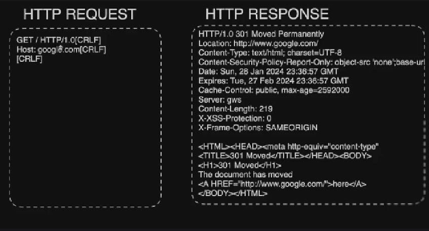
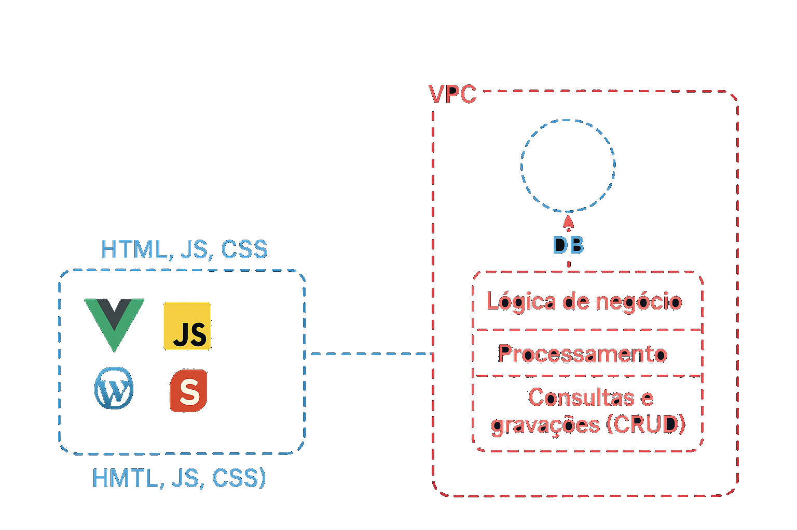
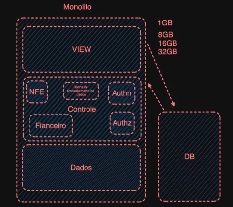
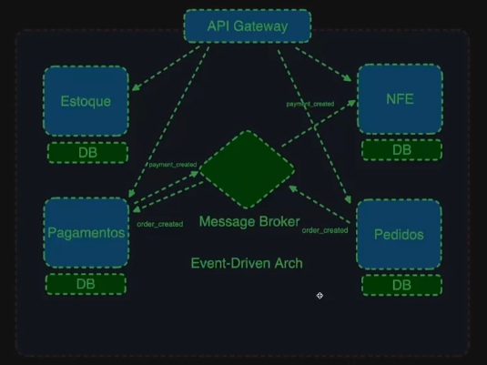

# Module: Base de aplicações WEB

## Como uma conexão HTTP funciona

O protocolo HTTP(Hypertext Transfer Protocal) é a base das aplicações Web, pois o mesmo é hoje o principal protocolo de comunicação e entrega de conteudo pelos navegardores, ou aplicações web based, sendo ele um protocolo `Request-Response`.
O HTTP funciona no envio e recebimento de cabeçalhos, esses cabeçalho seguem um padrão propostos pela [RFC 2616](https://datatracker.ietf.org/doc/html/rfc2616) sendo sua sintaxe:

```http
METHOD URI HTTP/X.X
HEADER-NAME: HEADER-VALUE
```

como por exemplo:

```http
GET / HTTP/1.0
Host: google.com

```



Já às Responses atuam de forma semelhante, porém que envia é o servidor, juntamente com o contudo do arquivo, ou ação, caso o arquivo seja para execução de alguma função na aplicação.

```http
HTTP/X.X STATS_CODE MSG
HEADER-NAME: HEADER-VALUE

DATA
```

se semelhante forma:

```http
HTTP/1.0 301 Moved Permanently
Location: http://www.google.com/
Content-Type: text/html; charset=UTF-8
Content-Security-Policy-Report-Only: object-src 'none';base-uri 'self';script-src 'nonce--PvC7mKnWO0xevFu7ueC8A' 'strict-dynamic' 'report-sample' 'unsafe-eval' 'unsafe-inline' https: http:;report-uri https://csp.withgoogle.com/csp/gws/other-hp
Date: Fri, 09 May 2025 18:17:52 GMT
Expires: Sun, 08 Jun 2025 18:17:52 GMT
Cache-Control: public, max-age=2592000
Server: gws
Content-Length: 219
X-XSS-Protection: 0
X-Frame-Options: SAMEORIGIN

<HTML><HEAD><meta http-equiv="content-type" content="text/html;charset=utf-8">
<TITLE>301 Moved</TITLE></HEAD><BODY>
<H1>301 Moved</H1>
The document has moved
<A HREF="http://www.google.com/">here</A>.
</BODY></HTML>
```

O protocolo HTTP utiliza-se de métodos para a realizações de funções na aplicação, sendo os mais comuns:

| Method   |
| -------- |
| **GET**  |
| **POST** |
| PUT      |
| DELETE   |
| CONNECT  |
| TRACE    |
| OPTIONS  |
| HEAD     |

Desses métodos, disparadamente, os mais utilizados são os métodos GET  e POST sendo utilizados para leitura e escrita de dados respectivamente.

 - GET
O método GET é utilizado para leitura de dados sendo eles o tipo que for, permitindo leitura de arquivos HTML, transferencia de arquivos etc...
Para sua utilização seus parâmetros são passados na URL do site, como por exemplo:
```php
https://localhost/index.php?user=admin
```
Utilizando o NetCat podemos realizar a requisição acima na construção do cabeçalho.
```sh
nc localhost 80
GET /index.php?user=admin HTTP/1.0
Host: 127.0.0.1
```
Ou também, utilizamos o cURL sendo ele um Client HTTP via CLI e criar a mesma requisição.
```sh
curl -X GET https://localhost/index.php?user=admin
	-H "Host: 127.0.0.1"
```

- POST
Já o método POST é utilizado para escrita, como por exemplo em uma Banco de Dados, onde diferentemente, do GET, os parâmetros do POST, são enviados no body do cabeçalho, como por exemplo, em um formulário de Login que são esperados os parâmetros `username` e `password`, a requisição fica:
```http
POST /login HTTP/1.0
Host:
User-Agent:

{
	username=admin&password=admin123
}
``` 
Já utilizando o cURL, o comando fica semelhante há:
```sh
curl -X POST https://localhost/login \
	-H "Host: 127.0.0.1" \
	-H "User-Agent: Mozilla/5.0 (platform; rv:geckoversion) Gecko/geckotrail Firefox/firefoxversion" \
	-d "{username=admin&password=admin123}"
```

Dentro dos cabeçalhos HTTP, existem diversas flags, data-types, status code etc... onde para melhores detalhes acesse sua [Documentação](https://developer.mozilla.org/pt-BR/docs/Web/HTTP/Reference/Headers).

## Arquitetura de aplicações (API GW, Micro-serviços e outros)

Nas requisições HTTP, a URI pode não só conter o caminha de arquivos e parâmetros dos mesmos, mas a URI pode direcionar para uma rota que pode retornar um Frotend, ou o mais comum, sendo uma API.

```http
POST /api/v2/login HTTP/1.1
```

Como podemos ver acima, temos uma requisição HTTP POST para a **rota** `/api/v2/login` que provavelmente recebe um json com `username` e `password`, agindo como um arquivo, porém utilizando rotas podemos organizar melhor a arquitetura de nosso projeto.
Afim de aprendizado, podemos criar rotas em node.js utilizando o Express Framework, como mostra o código abaixo:

```js
const express = require('express');
const app = express();

app.get("/", (req, res) => {
	res.send("Página Principal")
});

app.post("/api/v2/login", (req, res) => {
	req.json([
		{
			id: 1,
			username: "Guilherme",
			password: "p@ssw0rd"
		}
	])
})
```
Acima, temos um código que simula uma aplicação da requisição anterior, sendo esse um código pertencente ao **Backend** da aplicação, sendo TUDO que roda no servidor, já nas telas, páginas etc... temos o **Frontend**, esses funcionam em conjunto para o funcionamento de uma aplicação web, como mostra a imagem abaixo:



De maneira simples, uma aplicação pode conter 2 tipos diferentes dee Arquitetura, sendo elas Monolito e Micro-Serviços.
Sendo criadas e desenvolvidas de maneira diferentes, ambas utilizam a integração de Back e Frontend.

### Monolito

Monolitos, são aplicações que mais simples, geralemnte encontradas em softwares mais antigos, que centralizam todo seu desenvolvimento em uma mesma "Infraestrutura", se posso dizer dessa forma, sendo o FRONT e o BACKEND unidos e funcionam um dependente do outro, separando somente seu Banco de dados, assim como  mostra a imagem abaixo:



### Micro-Serviços

Já os micro-serviços, são uma forma de mais fácil de escalonar aplicações, pois cada funcionalidade importante da aplicação é desenvolvido como uma aplicação a parte, ou seja, caso aquela funcionalidade/Serviço, esteja sendo mais requisitada, podemos escalonar horizontalmente somente aquele serviço, não necessitando de um escalonamento vertical como em monolitos.
E para isso, existem diversas formas que micro-serviços, porém o mais utilizados são os Event-Driven Arch que são os micro-serviços baseados em eventos, pois para que os serviços comuniquem entre si, é necessário que haja um Message Broker, sendo ele um sistema de mensageria que informa a demanda para cada serviço, permitindo assim que não aconteça uma algazarra de requisições HTTP entre cada serviço.
Segue imagem do fluxo de funcionamento do modelo acima:

