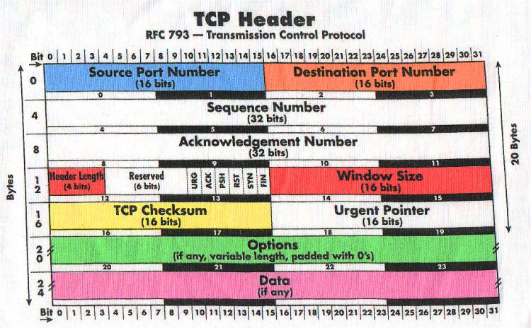
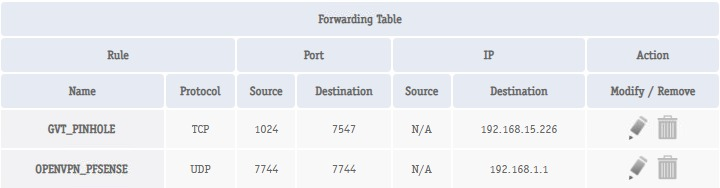

# Module: Introdução a redes de computadores

## Redes de computadores I - TCP/IP
O modelo TCP/IP é a base de uma comunicação em uma rede, sendo adotado como padrão em uma conexão sendo ela qual for.
O TCP/IP atua em 4 camadas que atua separadamente no processo de conexão, sendo elas:

| TCP/IP      | Protocols         |
| ----------- | ----------------- |
| Application | HTTP, Telnet, FTP |
| Transport   | TCP, UDP          |
| Internet    | IP                |
| Link        | Enlace            |
Em uma comunicação TCP/IP entre dois hosts é realizada com o envio de cabeçalho(headers), que enviam informações de ambos hosts como IP, portas, flags e dados.
Esse header segue a estrutura abaixo:



Sabendo disso, simulando uma conexão de um Cliente e um Servidor, e filtrando a mesma pelo Wireshark conseguimos entender melhor como uma conexão TCP é realizada na prática.

```sh
(server):$ nc -lnvp 1234

(client):$ nc localhost 1234
```

O comando acima utiliza a ferramenta NetCat, que atua como um cliente/servidor TCP, sabendo disso, estamos realizando uma conexão TCP em loopback, ou seja, para minha própria máquina, que também está "escutando" uma conexão na porta 1234.

Para que essa conexão seja realizada, o protocolo TCP realiza o **Three-Way Handshake (três vias do TCP)**

```sh
  Client                                 Server
	|                                      |
	| --------------- SYN ---------------> |
	|                                      |
	| <------------ SYN/ACK -------------- |
	|                                      |
	| --------------- ACK ---------------> |
	|                                      |
	|--------- Conexão Estabelecida -------|
```

Com isso, no Wireshark, ferramenta de captura de rede e sniffing podemos ver todo processo de conexão confirmando assim todo o processo relatado acima:


## Redes de computadores II - ARP/BGP/NAT

O protocolo ARP, ou Address Resolution Protocol é um protocolo de rede que realiza a conversão da camada de Internet em Endereços da camada de Enlace.
Para isso, o ARP solicita o MAC de um dispositivo em especifico via Broadcast, após sua resposta suas informações, como:

| IP  | MAC | Interface |
| --- | --- | --------- |

Com essas informações armazenados em uma tabela em cache(ARP Table), o ARP permite que o envio de dados possa ser direcionado, e não para todos os hosts da rede como acontecia antes de sua criação.

Para uma conexão entre duas redes diferentes, é necessário que haja um **Roteador(Router) de Borda**, sendo ele o Gateway da rede, permitindo que, por exemplo computadores da rede `192.168.0.0/24` possam se conectar a servidores da rede `10.10.0.0/24`.
O protocolo BGP atua como um Roteador(Router) de Borda, porém para internet, comunmente sendo seu provedor de internet(ISP) o BGP.


O NAT, ou Network Address Translation é um protocolo que permite que os provedores possam entregar seu conteúdo para os roteadores e os Roteadores possam direcionar o conteudo ao computador que solicitou tal conteúdo.
O NAT mapeia conexões internas para portas específicas no roteador, permitindo que as respostas sejam redirecionadas corretamente ao solicitante original.
Exemplo de entrada em uma tabela NAT:


Isso é especialmente útil para economizar endereços IPv4 e aumentar a segurança, pois máquinas internas não são diretamente acessíveis pela internet.

## Redes de computadores III - DNS

DNS, ou Sistema de Nomes de Domínio, é o protocolo responsável por traduzir nomes de domínio (como `exemplo.com`) para endereços IP, permitindo que navegadores e aplicações localizem servidores na rede.

O DNS é hierárquico e funciona em várias camadas. Abaixo, explico as principais:

É o topo da hierarquia DNS. Os **servidores raiz** são representados por letras (A, B, C...) e são os primeiros a serem consultados em uma resolução de nome. Eles indicam onde encontrar os servidores TLD.

Abaixo da raiz estão os **TLDs** (Top-Level Domains), que podem ser:

- Genéricos: `.com`, `.org`, `.net`, etc.
    
- De país: `.br`, `.us`, `.fr`, etc.
    
Cada TLD é gerenciado por uma entidade (ICANN, NIC.br, entre outras).

- Domínio de Segundo Nível (SLD)
É a parte que vem antes do TLD. Em `exemplo.com`, a palavra **exemplo** é o SLD. Essa parte normalmente representa o nome da empresa ou do projeto.

- Subdomínios
São ramificações do SLD. No endereço `blog.exemplo.com`, **blog** é um subdomínio de `exemplo.com`. Eles ajudam a estruturar serviços (como `api.`, `admin.`, `cdn.`...).

- Registros DNS
Cada domínio pode ter vários tipos de registros. Os mais comuns:

- **A**: Mapeia um domínio para um IP (IPv4)
- **AAAA**: Mapeia para IPv6
- **MX**: Define servidores de e-mail
- **CNAME**: Cria um alias para outro domínio
- **TXT**: Armazena texto arbitrário (SPF, verificação, etc.)
- **NS**: Define os nameservers responsáveis
- **SOA**: Informação de origem da zona DNS

A **Enumeração de DNS** é uma etapa importante no **Footprinting**, fase de coleta de informações de um alvo.

Essa técnica busca listar todos os registros DNS associados a um domínio — como nomes de host, IPs, TTLs, servidores de e-mail, aliases e mais.
Um **erro comum de configuração DNS** é permitir **transferência de zona AXFR** para qualquer requisição. Isso permite que um atacante obtenha todos os registros da zona, o que pode expor a estrutura interna da rede.

Comando básico para consulta de registros:

```bash
dig @<nameserver> <dominio> AXFR
```

Ou para listar qualquer tipo de registro disponível:

```bash
dig <dominio> ANY
```

